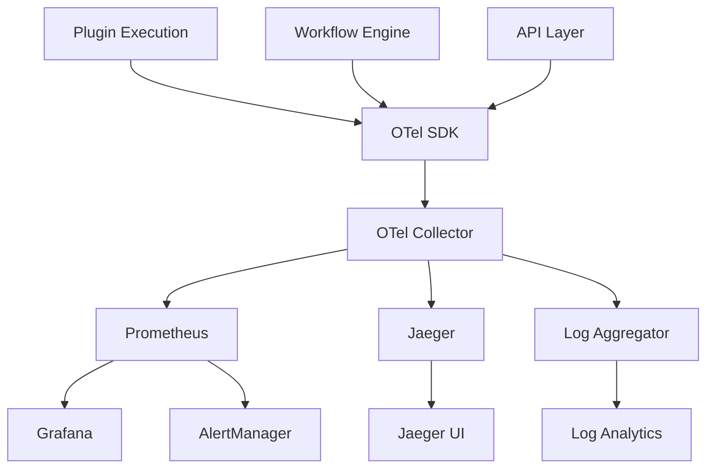

# ADR-003: OpenTelemetry for Observability

## Status
Accepted (2025-06-23)

## Context

A production ML platform requires comprehensive observability to:

1. **Debug Issues**: Trace requests across distributed plugin executions
2. **Monitor Performance**: Track latency, throughput, and resource usage
3. **Ensure Reliability**: Detect and alert on system degradation
4. **Optimize Costs**: Understand resource consumption patterns
5. **Compliance**: Maintain audit trails for ML operations

Key requirements:
- **Unified Telemetry**: Single system for metrics, traces, and logs
- **Vendor Neutrality**: Avoid lock-in to specific monitoring vendors
- **ML-Specific Metrics**: Track model performance, data drift, training metrics
- **Correlation**: Link traces across workflow execution and plugin operations
- **Standards Compliance**: Use industry-standard telemetry protocols

## Decision

We adopt **OpenTelemetry (OTel)** as the observability foundation, combined with:

1. **Metrics**: Prometheus for collection, Grafana for visualization
2. **Tracing**: Jaeger for distributed tracing storage and UI
3. **Logging**: Structured JSON logs with correlation IDs
4. **Alerting**: Prometheus AlertManager with multiple notification channels

### Implementation Architecture



### Key Implementation Details

1. **Auto-Instrumentation**: Automatic tracing for HTTP, database, and plugin calls
2. **Custom Metrics**: ML-specific metrics for model performance and data quality
3. **Correlation**: Trace IDs propagated through all operations
4. **Sampling**: Intelligent sampling to manage telemetry volume
5. **Export**: Multiple export formats (OTLP, Prometheus, Jaeger)

## Alternatives Considered

### 1. Vendor-Specific Solutions (DataDog, New Relic)
- **Pros**: Complete integrated solution, rich analytics, good support
- **Cons**: Vendor lock-in, high cost at scale, limited customization
- **Rejected**: Vendor lock-in concerns and cost considerations

### 2. Custom Telemetry System
- **Pros**: Perfect fit for requirements, full control, no vendor dependency
- **Cons**: High development cost, reliability concerns, maintenance burden
- **Rejected**: Not core competency, high opportunity cost

### 3. Individual Best-of-Breed Tools
- **Pros**: Specialized tools for each use case, proven solutions
- **Cons**: Integration complexity, data silos, inconsistent correlation
- **Rejected**: Too much integration overhead

### 4. Cloud-Native Solutions (AWS X-Ray, Azure Monitor)
- **Pros**: Native cloud integration, serverless-friendly, good performance
- **Cons**: Vendor lock-in, limited cross-cloud support, feature gaps
- **Rejected**: Multi-cloud requirements not met

## Consequences

### Positive
1. **Vendor Neutrality**: Can switch backends without code changes
2. **Standards Compliance**: Industry-standard telemetry protocols
3. **Unified Telemetry**: Single SDK for metrics, traces, and logs
4. **Rich Ecosystem**: Large ecosystem of exporters and receivers
5. **Future-Proof**: Active CNCF project with strong community
6. **Cost Control**: Self-hosted option reduces long-term costs
7. **Correlation**: Built-in trace context propagation
8. **ML Integration**: Custom metrics for ML-specific monitoring

### Negative
1. **Complexity**: Additional infrastructure components to manage
2. **Learning Curve**: Teams must learn OTel concepts and APIs
3. **Resource Overhead**: Telemetry collection consumes resources
4. **Configuration**: Complex configuration for optimal performance
5. **Storage Costs**: High-volume telemetry data storage requirements

### Risk Mitigation
1. **Training**: Comprehensive team training on OTel concepts
2. **Staged Rollout**: Gradual introduction starting with critical paths
3. **Resource Monitoring**: Monitor telemetry infrastructure itself
4. **Sampling Strategy**: Intelligent sampling to control data volume
5. **Backup Systems**: Fallback monitoring for critical metrics

### Implementation Strategy

#### Phase 1: Foundation
- Deploy OTel Collector, Prometheus, Jaeger
- Basic auto-instrumentation for HTTP and database calls
- Core system metrics collection

#### Phase 2: Plugin Integration
- Custom instrumentation for plugin execution
- Plugin-specific metrics and traces
- Workflow orchestration tracing

#### Phase 3: ML Metrics
- Model performance metrics
- Data drift detection
- Training job monitoring

#### Phase 4: Advanced Features
- Custom dashboards and alerts
- SLA monitoring
- Performance optimization

### ML-Specific Metrics
```python
# Model performance metrics
model_prediction_latency = otel_metrics.create_histogram(
    "mlx_model_prediction_latency_seconds",
    description="Model prediction latency",
    unit="s"
)

model_accuracy = otel_metrics.create_gauge(
    "mlx_model_accuracy_score",
    description="Model accuracy score"
)

data_drift_score = otel_metrics.create_gauge(
    "mlx_data_drift_score",
    description="Data drift detection score"
)

# Plugin execution metrics
plugin_execution_duration = otel_metrics.create_histogram(
    "mlx_plugin_execution_duration_seconds",
    description="Plugin execution time",
    unit="s"
)
```
