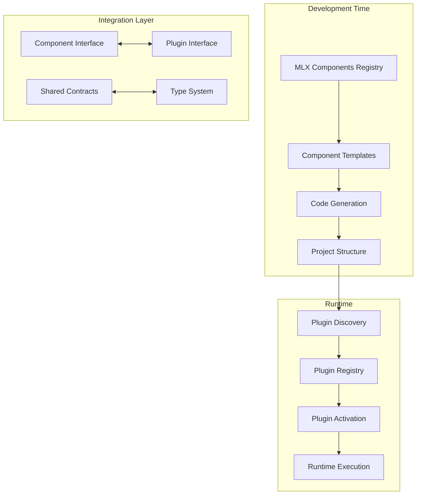
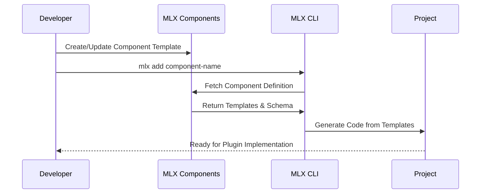
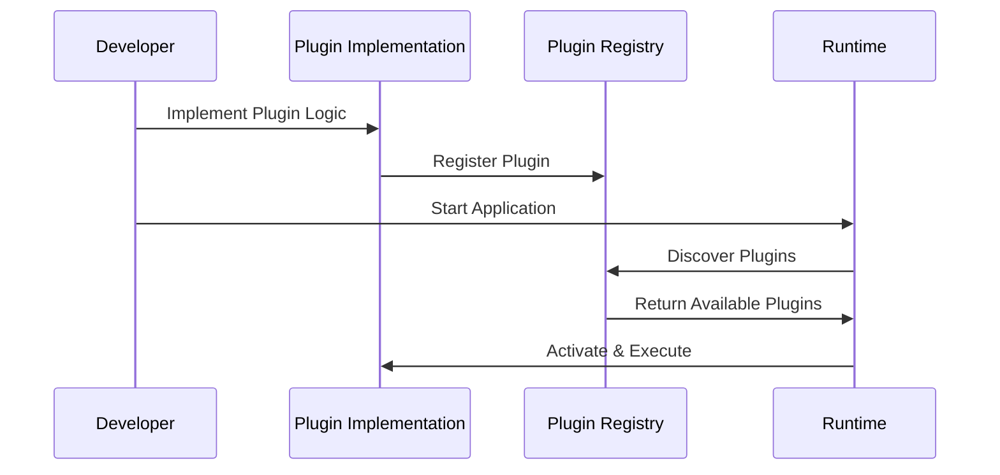

# Plugins and MLX Components Architecture

## Overview

The MLX platform uses a dual-layer architecture that combines **MLX Components** (static templates) with **Plugins** (dynamic runtime components) to provide maximum flexibility and composability for ML systems.

## Architecture Layers



## MLX Components (@mlx-components/)

### Purpose
MLX Components are **static, reusable code templates** that provide:
- Consistent project structure and boilerplate
- Best practices and architectural patterns
- Type-safe interfaces and contracts
- Documentation and examples

### Structure
```
mlx-components/
├── registry.json                 # Component catalog and metadata
├── api-serving/                  # FastAPI service templates
│   ├── component.json           # Component definition
│   ├── README.md                # Usage documentation
│   └── templates/               # Code templates
│       ├── app.py.template
│       ├── routes.py.template
│       └── models.py.template
├── config-management/           # Configuration system templates
├── plugin-registry/             # Plugin system templates
├── data-processing/             # Data pipeline templates
└── utilities/                   # Utility templates
```

### Component Definition
```json
{
  "name": "api-serving",
  "version": "1.2.0",
  "description": "FastAPI service templates with production features",
  "type": "service",
  "dependencies": ["config-management"],
  "templates": [
    {
      "name": "app.py.template",
      "description": "Main FastAPI application",
      "target": "src/platform/api/app.py",
      "variables": ["app_name", "enable_cors", "enable_auth"]
    }
  ],
  "config_schema": {
    "app_name": {"type": "string", "default": "mlx-api"},
    "port": {"type": "integer", "default": 8000},
    "enable_cors": {"type": "boolean", "default": true}
  }
}
```

## Plugins (Runtime Components)

### Purpose
Plugins are **dynamic, runtime components** that provide:
- Live functionality and business logic
- External service integration
- Configurable behavior
- Hot-swappable implementations

### Plugin Hierarchy
```python
# Base plugin interface
class MLOpsComponent(ABC):
    @abstractmethod
    def initialize(self, context: ExecutionContext) -> None: ...

    @abstractmethod
    def execute(self, context: ExecutionContext) -> ComponentResult: ...

# Typed plugin with metadata
class TypedPlugin(MLOpsComponent):
    def __init__(self, metadata: PluginMetadata): ...

# Specific implementations
class DataSourcePlugin(TypedPlugin): ...
class MLPlatformPlugin(TypedPlugin): ...
class LLMProviderPlugin(TypedPlugin): ...
```

## Relationship Between Components and Plugins

### 1. Component-to-Plugin Generation

**MLX Components generate Plugin scaffolding:**

```bash
# Use component to generate plugin structure
mlx add plugin-registry --plugin-type=ml_platform --name=databricks

# Generates:
src/platform/plugins/
├── databricks_plugin.py      # From plugin-registry/templates/
├── __init__.py               # Auto-registration code
└── tests/
    └── test_databricks.py    # Test templates
```

**Generated Plugin Code:**
```python
# Generated from plugin-registry/templates/ml_platform.py.template
from src.platform.plugins.types import TypedPlugin, PluginType, PluginMetadata

@register_plugin_type(PluginType.ML_PLATFORM)
class DatabricksPlugin(TypedPlugin):
    def get_default_metadata(self) -> PluginMetadata:
        return PluginMetadata(
            name="databricks",
            plugin_type=PluginType.ML_PLATFORM,
            version="1.0.0",
            description="Databricks unified analytics platform",
            capabilities=["data_processing", "ml_training", "model_serving"],
            conflicts_with=["outerbounds-plugin", "sagemaker-plugin"],
            # ... metadata from component template
        )

    def initialize(self, context: ExecutionContext) -> None:
        # Implementation generated from template
        pass
```

### 2. Interface Contracts

**Components define the contracts, Plugins implement them:**

```python
# Component template defines interface
class DataSourceContract(ABC):
    @abstractmethod
    def connect(self, config: Dict[str, Any]) -> Connection: ...

    @abstractmethod
    def query(self, sql: str) -> DataFrame: ...

# Plugin implements the contract
class SnowflakePlugin(DataSourcePlugin):
    def connect(self, config: Dict[str, Any]) -> Connection:
        return snowflake.connector.connect(**config)

    def query(self, sql: str) -> DataFrame:
        return pd.read_sql(sql, self.connection)
```

### 3. Configuration Schema Inheritance

**Components provide configuration schemas:**

```json
// mlx-components/data-sources/snowflake/component.json
{
  "config_schema": {
    "account": {"type": "string", "required": true},
    "user": {"type": "string", "required": true},
    "password": {"type": "string", "required": true, "secret": true},
    "warehouse": {"type": "string", "default": "COMPUTE_WH"},
    "database": {"type": "string", "required": true},
    "schema": {"type": "string", "default": "PUBLIC"}
  }
}
```

**Plugins inherit and extend schemas:**

```python
class SnowflakePlugin(DataSourcePlugin):
    def get_default_metadata(self) -> PluginMetadata:
        # Base schema from component + plugin-specific extensions
        base_schema = load_component_schema("data-sources/snowflake")

        return PluginMetadata(
            config_schema={
                **base_schema,
                "connection_pool_size": {"type": "integer", "default": 5},
                "query_timeout": {"type": "integer", "default": 300},
            }
        )
```

## Integration Patterns

### 1. Component-First Development

**Start with components for structure:**

```bash
# 1. Initialize project with core components
mlx init my-ml-platform
mlx add api-serving
mlx add config-management
mlx add plugin-registry

# 2. Add specific plugins
mlx add data-source --plugin-type=snowflake
mlx add ml-platform --plugin-type=databricks
mlx add llm-provider --plugin-type=openai
```

### 2. Plugin Composition Patterns

**Components define composition templates:**

```yaml
# mlx-components/compositions/enterprise-stack.yaml
name: "Enterprise ML Stack"
description: "Production-ready ML platform with enterprise integrations"
components:
  - api-serving
  - config-management
  - plugin-registry
  - monitoring
plugins:
  - type: data_source
    name: snowflake
    config:
      connection_pool_size: 10
  - type: ml_platform
    name: databricks
    config:
      cluster_policy: "enterprise"
  - type: experiment_tracker
    name: mlflow
conflicts:
  - [databricks, outerbounds]  # Cannot use both ML platforms
  - [mlflow, wandb]            # Cannot use both experiment trackers
```

### 3. Runtime Plugin Discovery

**Components provide discovery metadata:**

```python
# Auto-generated from component templates
def discover_component_plugins() -> List[PluginMetadata]:
    """Discover plugins generated from MLX components."""
    discovered = []

    # Scan component-generated plugins
    for component_path in get_component_paths():
        plugin_manifest = component_path / "plugins.json"
        if plugin_manifest.exists():
            plugins = load_plugin_manifest(plugin_manifest)
            discovered.extend(plugins)

    return discovered
```

## Development Workflow

### 1. Component Development Cycle



### 2. Plugin Development Cycle



## Component Categories and Plugin Types

### Mapping Table

| Component Category | Generates Plugin Types | Purpose |
|-------------------|------------------------|---------|
| **api-serving** | `serving_platform` | REST/GraphQL API endpoints |
| **config-management** | `configuration` | Hierarchical config systems |
| **plugin-registry** | `plugin_system` | Plugin discovery & management |
| **data-processing** | `data_processor` | ETL/ELT pipelines |
| **ml-training** | `ml_trainer` | Model training workflows |
| **model-serving** | `model_server` | Model inference endpoints |
| **monitoring** | `monitoring` | Observability & alerting |
| **security** | `security` | Auth, encryption, access control |
| **workflow-orchestration** | `workflow_engine` | Pipeline orchestration |

### Example: Data Processing Component → Plugin

**Component Definition:**
```json
{
  "name": "data-processing",
  "generates_plugin_types": ["data_processor"],
  "templates": [
    "base_processor.py.template",
    "spark_processor.py.template",
    "pandas_processor.py.template"
  ],
  "integration_points": [
    "data_sources",
    "feature_stores",
    "ml_platforms"
  ]
}
```

**Generated Plugin Interface:**
```python
class DataProcessorPlugin(TypedPlugin):
    def process_data(self, input_data: DataFrame) -> DataFrame:
        """Process input data and return transformed data."""
        pass

    def validate_schema(self, data: DataFrame) -> bool:
        """Validate data schema."""
        pass
```

**Concrete Implementation:**
```python
class SparkDataProcessor(DataProcessorPlugin):
    def process_data(self, input_data: DataFrame) -> DataFrame:
        # Spark-specific processing logic
        return spark.sql("SELECT * FROM input_data WHERE quality_score > 0.8")
```

## Benefits of the Dual Architecture

### 1. Separation of Concerns
- **Components**: Structure, patterns, best practices
- **Plugins**: Business logic, integrations, runtime behavior

### 2. Rapid Development
- **Components**: Bootstrap projects quickly with proven patterns
- **Plugins**: Focus on implementation without boilerplate

### 3. Consistency
- **Components**: Ensure consistent code structure across teams
- **Plugins**: Standardized interfaces for integration

### 4. Flexibility
- **Components**: Can generate multiple plugin variants
- **Plugins**: Can be swapped without changing core structure

### 5. Evolution
- **Components**: Update templates to improve generated code
- **Plugins**: Update implementations without regenerating structure

## Best Practices

### 1. Component Design
- Keep templates focused and single-purpose
- Provide comprehensive configuration schemas
- Include documentation and examples
- Version components semantically

### 2. Plugin Implementation
- Follow interface contracts strictly
- Implement comprehensive error handling
- Provide detailed metadata
- Include integration tests

### 3. Composition Strategy
- Start with proven component combinations
- Test plugin interactions thoroughly
- Document composition patterns
- Monitor runtime performance

This architecture enables the MLX platform to be both structured (via components) and flexible (via plugins), providing the best of both worlds for building sophisticated ML systems.
